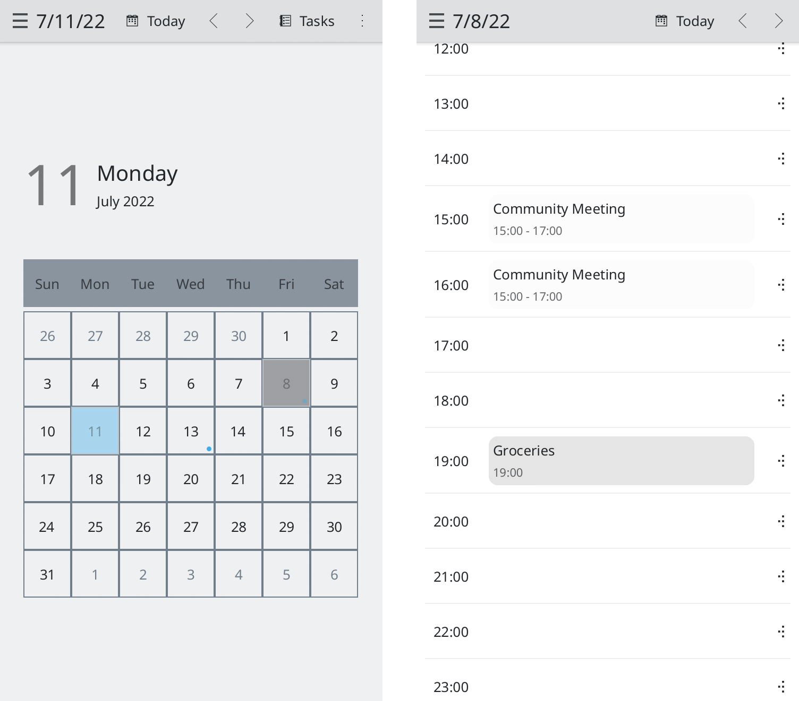

<!--
    SPDX-FileCopyrightText: 2020 Dimitris Kardarakos <dimkard@posteo.net>
    SPDX-FileCopyrightText: 2022 Devin Lin <devin@kde.org>
    SPDX-License-Identifier: CC-BY-SA-4.0
-->
# Calindori  

Calendar application for Plasma Mobile.

## Links

* Project page: https://invent.kde.org/plasma-mobile/calindori
* File an issue: https://invent.kde.org/plasma-mobile/calindori/-/issues
* Development channel: https://matrix.to/#/#plasmamobile:matrix.org

## Features

Calindori is a touch friendly calendar application. It has been designed for mobile devices but it can also run on desktop environments. It offers:

* Monthly agenda
* Multiple calendars
* Event management
* Task management
* Calendar import



The calendars that the application handles follow the [ical](https://tools.ietf.org/html/rfc5545) standard.


## Build

To build Calindori from source on Linux, execute the below commands.

### Compile

```
git clone https://invent.kde.org/kde/calindori.git
cd calindori
mkdir build
cd build
cmake ..
make -j$(nproc)
```

#### Run

```
bin/calindori
```

*To simulate Plasma Mobile user experience:*

```
QT_QUICK_CONTROLS_MOBILE=true bin/calindori
```

#### Install

```
sudo make install
```

### Android

The nightly build of Calindori for Android can be found in the F-Droid instance of KDE. You can add the repository following these [instructions](https://community.kde.org/Android/FDroid) and install Calindori.
